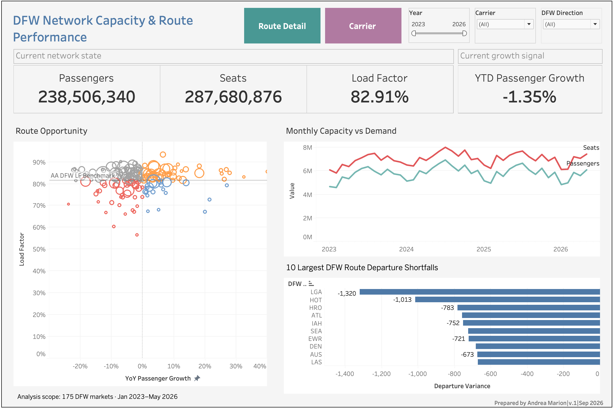
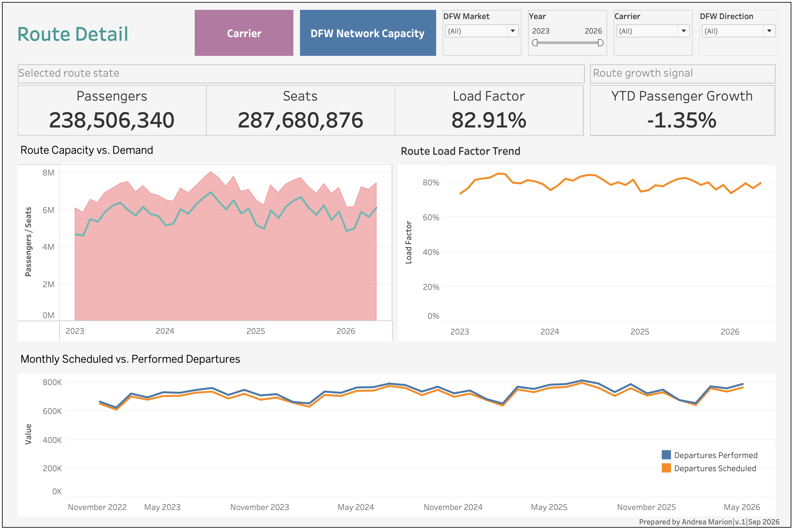
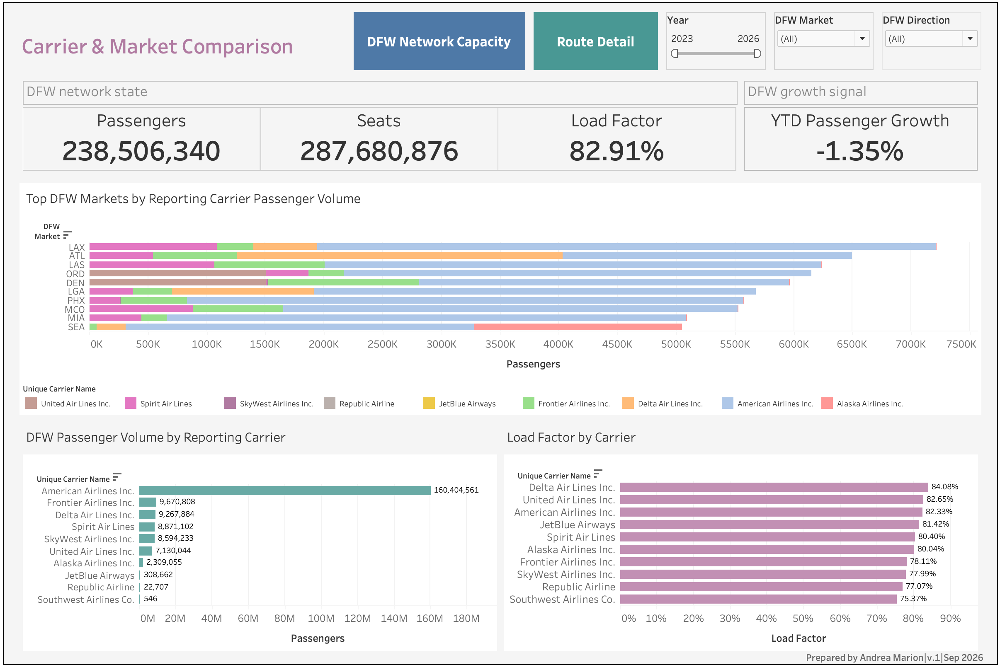

# AA- Project

## Overview

End-to-end airline network planning analytics project using BTS T-100 data, PostgreSQL, SQL, and Tableau to analyze DFW passenger demand, seat capacity, load factor, route growth, schedule execution, and carrier mix for capacity-planning decisions.

## Live Dashboards

## Report Pages
1. Executive Overview
2. Route Detail
3. Carrier & Market Comparison

## Business questions addressed
- Where should DFW Network Planning investigate potential capacity changes?
- Which markets show capacity pressure, excess capacity, or capacity growing ahead of demand?
- How are passenger demand, seat capacity, and load factor changing over time?
- Which markets have the largest scheduled-versus-performed departure shortfalls?
- How does reporting-carrier activity vary across major DFW markets?
- Which routes warrant different planning responses based on growth and utilization patterns?

## Report Pages

### Executive Overview

### Route Detail

### Carrier & Market Comparison

### Tools Used

- PostgreSQL
- SQL
- Tableau Public
- Excel/CSV for source-file handling

### Data Source

U.S. Department of Transportation, Bureau of Transportation Statistics: T-100 Domestic Segment (All Carriers). The table contains domestic nonstop segment data including passengers, seats, scheduled/performed departures, distance, carrier, airports, and aircraft information.

### Project Period

January 2023 – May 2026.

# Author

**Andrea Marion**  
Operations Analytics | BI Developer

